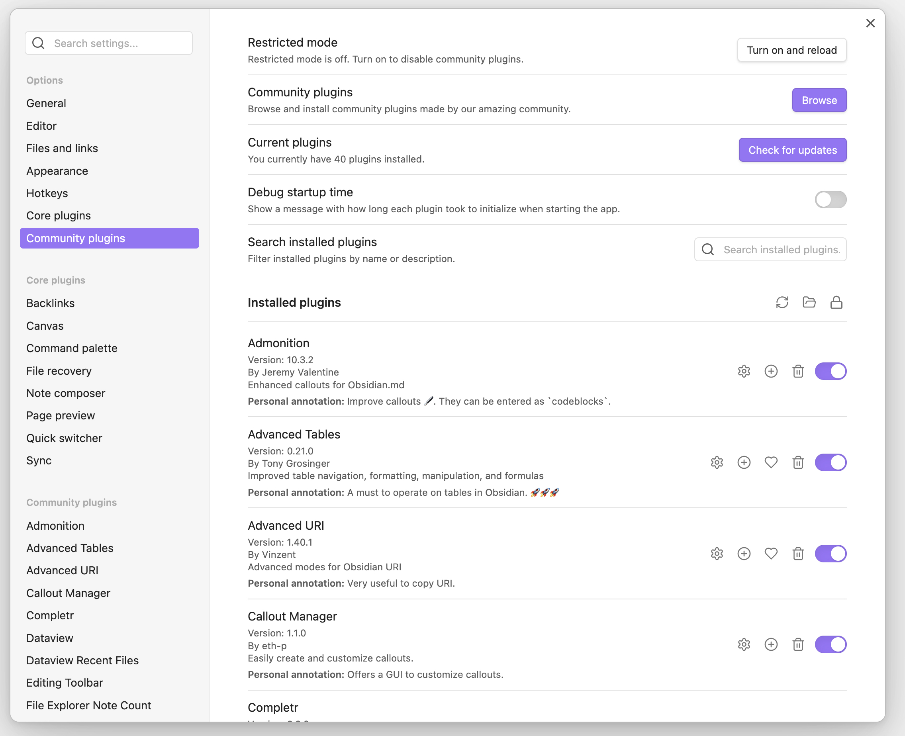

# Obsidian Plugin Comment

Obsidian Plugin Comment is a plugin for [Obsidian](https://obsidian.md) that allows users to add personal annotations to each installed plugin. This is particularly useful for keeping track of why certain plugins are installed and their specific use cases.

## Features

- Add personal annotations to any installed plugin in the settings pane.
- Annotations are saved persistently and can be edited at any time.
- Annotations are displayed directly below the plugin information.

## Installation

1. Download the latest release from the [Releases](https://github.com/alberti42/obsidian-plugin-comment/releases) page.
2. Extract the files into your Obsidian plugins folder: `<vault>/.obsidian/plugins/obsidian-plugin-comment`.
3. Enable the plugin in the "Community plugins" settings pane.

## Usage

1. Open the "Community plugins" settings pane.
2. You will see a text area below each installed plugin where you can add your personal annotation.
3. Annotations are automatically saved and will be displayed whenever you open the settings pane.

## Screenshot



## Development

To contribute to the development of this plugin, follow these steps:

1. Fork the repository on GitHub.
2. Clone your forked repository:
   ```sh
   git clone https://github.com/your-username/obsidian-plugin-comment.git
   ```
3. Navigate to the plugin directory:
   ```sh
   cd obsidian-plugin-comment
   ```
4. Install the dependencies:
   ```sh
   npm install
   ```
5. Build the plugin:
   ```sh
   npm run build
   ```
6. Enable the plugin in Obsidian and start developing!

## Donations
I would be grateful for any donation to support the development of this plugin.

[](https://buymeacoffee.com/alberti)

## Author
- **Author:** Andrea Alberti
- **GitHub Profile:** [alberti42](https://github.com/alberti42)
- **Donations:** [](https://buymeacoffee.com/alberti)

Feel free to contribute to the development of this plugin or report any issues in the [GitHub repository](https://github.com/alberti42/obsidian-plugin-comment/issues).
